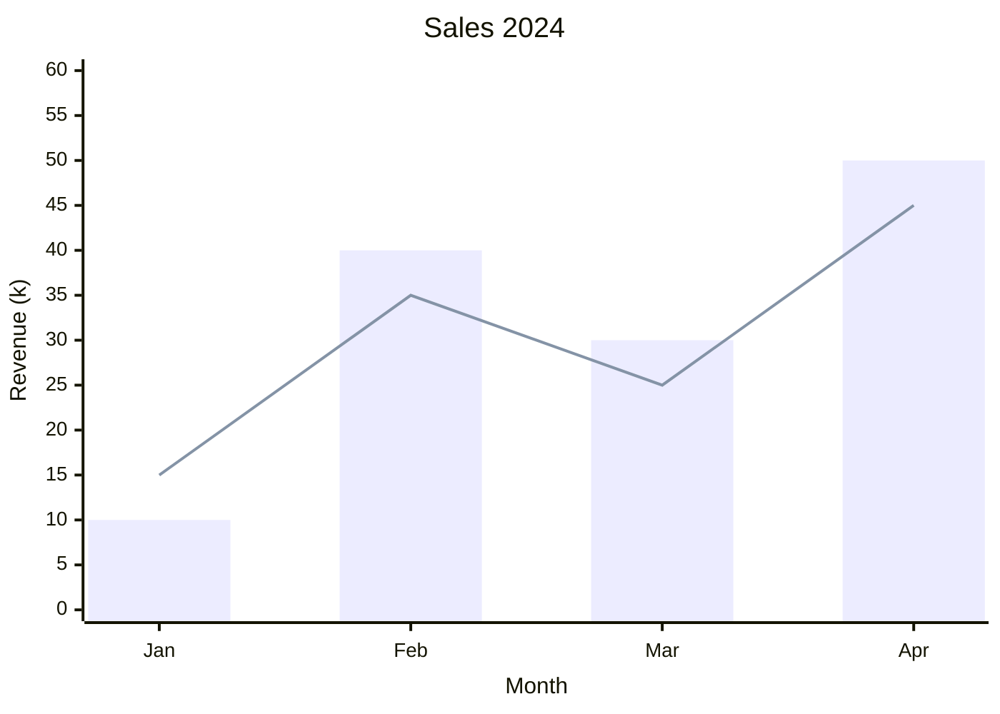

# seanymph
A matplotlib-style Python library for generating Mermaid diagrams


## Usage
```python
from seanymph import XYChart

months = ["Jan", "Feb", "Mar", "Apr"]
fig = XYChart()
fig.bar(months, [10, 40, 30, 50])
fig.line(months, [15, 35, 25, 45])
fig.xlabel("Month")
fig.ylabel("Revenue (k)")
fig.ylim(0, 60)
fig.title("Sales 2024")
```
results in the following mermaid chart:


