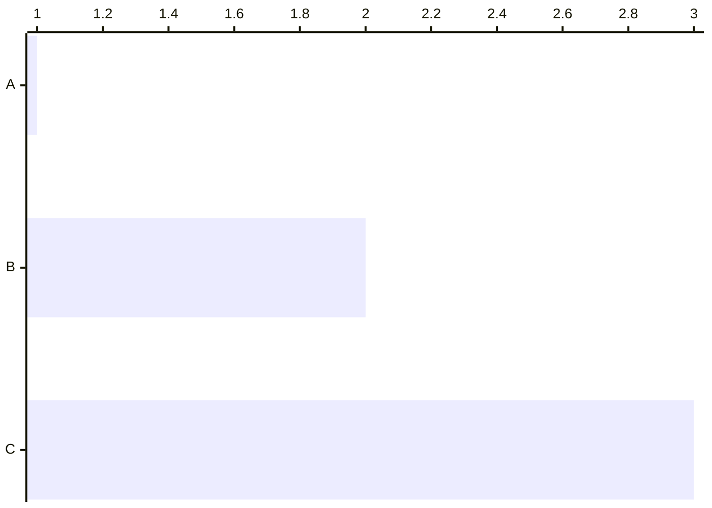
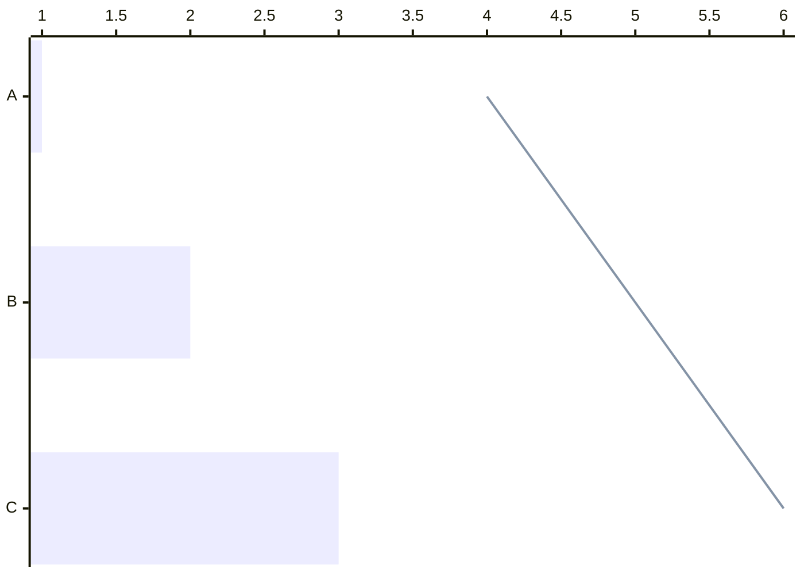
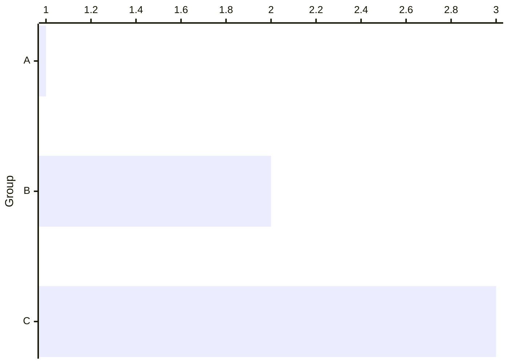
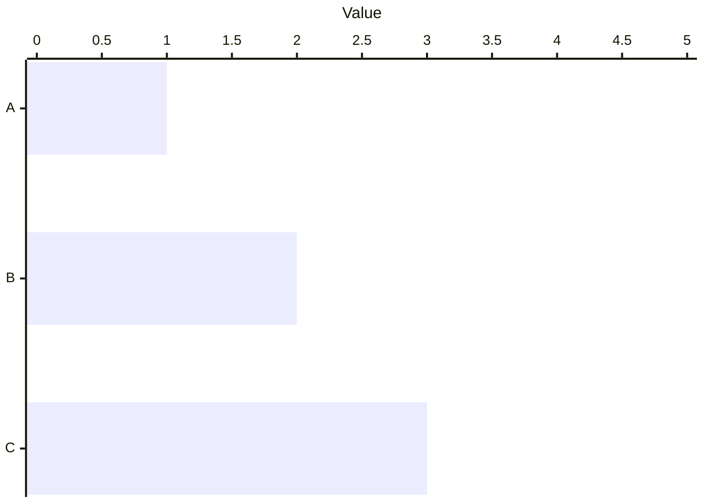

```mermaid
xychart-beta horizontal
    x-axis [A, B, C]
    bar [1, 2, 3]
```

```mermaid
xychart-beta horizontal
    x-axis [A, B, C]
    line [1, 2, 3]
```

```mermaid
xychart-beta horizontal
    x-axis [A, B, C]
    bar [1, 2, 3]
    line [4, 5, 6]
```

```mermaid
xychart-beta horizontal
    x-axis "Group" [A, B, C]
    bar [1, 2, 3]
```

```mermaid
xychart-beta horizontal
    x-axis [A, B, C]
    y-axis "Value" 0 --> 5
    bar [1, 2, 3]
```
