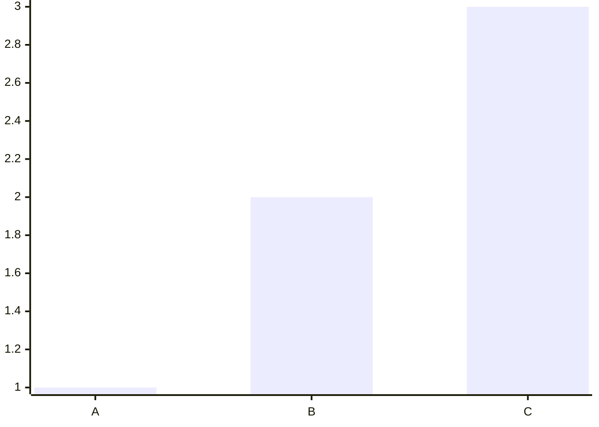
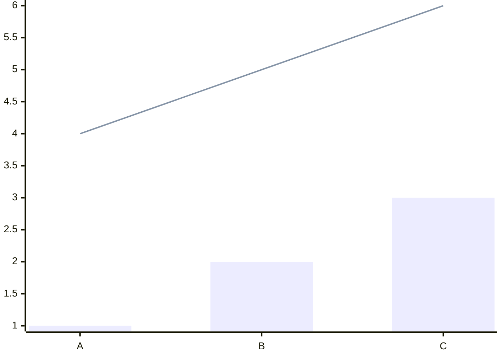
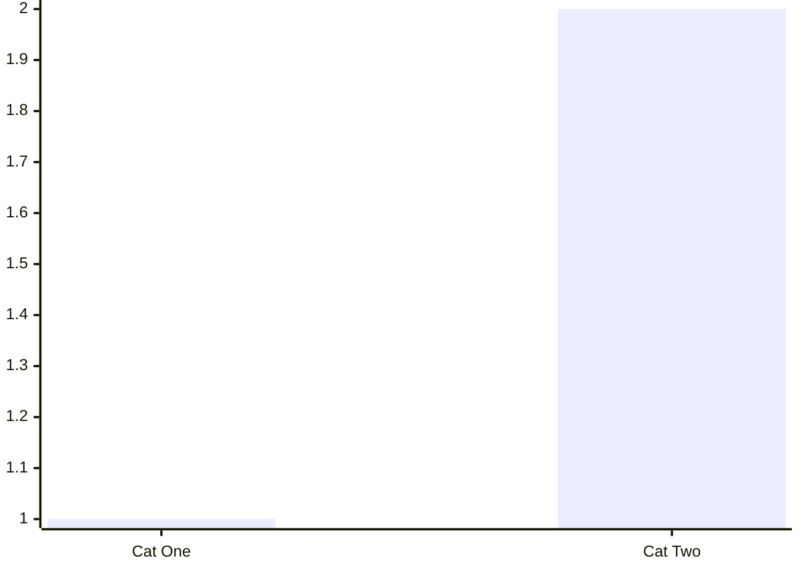
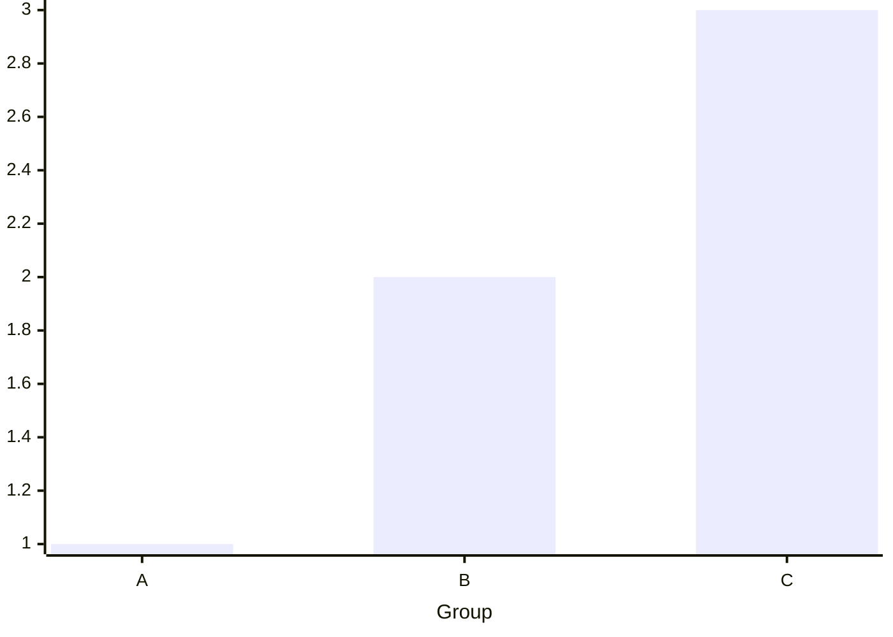
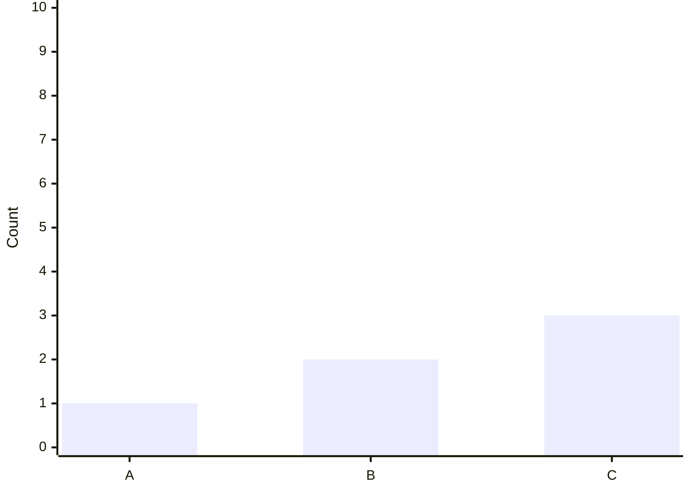
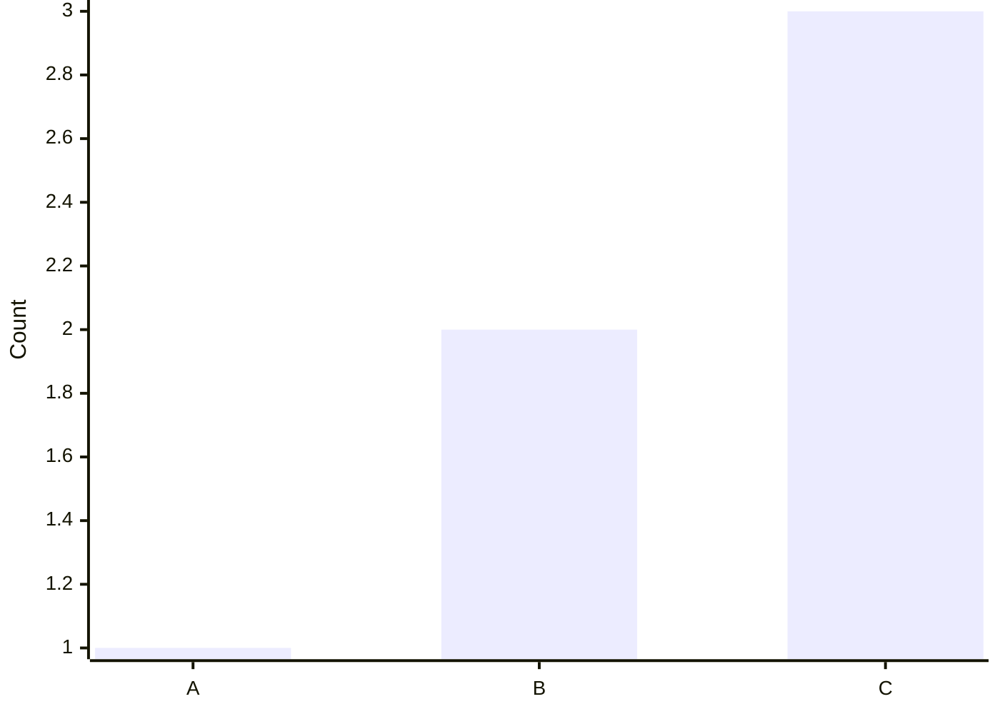
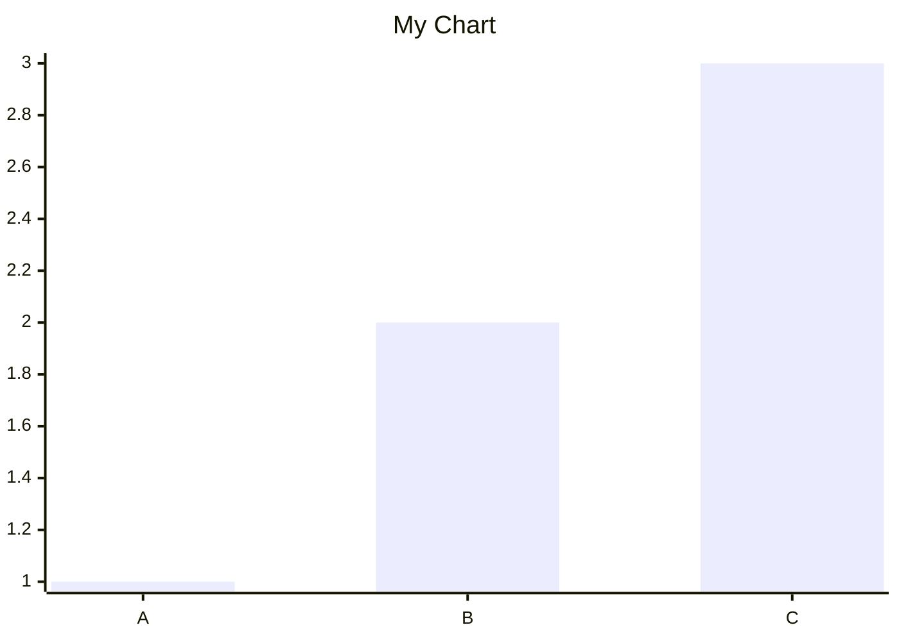

```mermaid
xychart-beta
    x-axis [A, B, C]
    bar [1, 2, 3]
```

```mermaid
xychart-beta
    x-axis [A, B, C]
    line [1, 2, 3]
```

```mermaid
xychart-beta
    x-axis [A, B, C]
    bar [1, 2, 3]
    line [4, 5, 6]
```

```mermaid
xychart-beta
    x-axis ["Cat One", "Cat Two"]
    bar [1, 2]
```

```mermaid
xychart-beta
    x-axis "Group" [A, B, C]
    bar [1, 2, 3]
```

```mermaid
xychart-beta
    x-axis [A, B, C]
    y-axis "Count" 0 --> 10
    bar [1, 2, 3]
```

```mermaid
xychart-beta
    x-axis [A, B, C]
    y-axis "Count"
    bar [1, 2, 3]
```

```mermaid
xychart-beta
    title "My Chart"
    x-axis [A, B, C]
    bar [1, 2, 3]
```

```mermaid
xychart-beta
    x-axis [A, B, C]
    bar [1, 2, 3]
    line [4, 5, 6]
```
