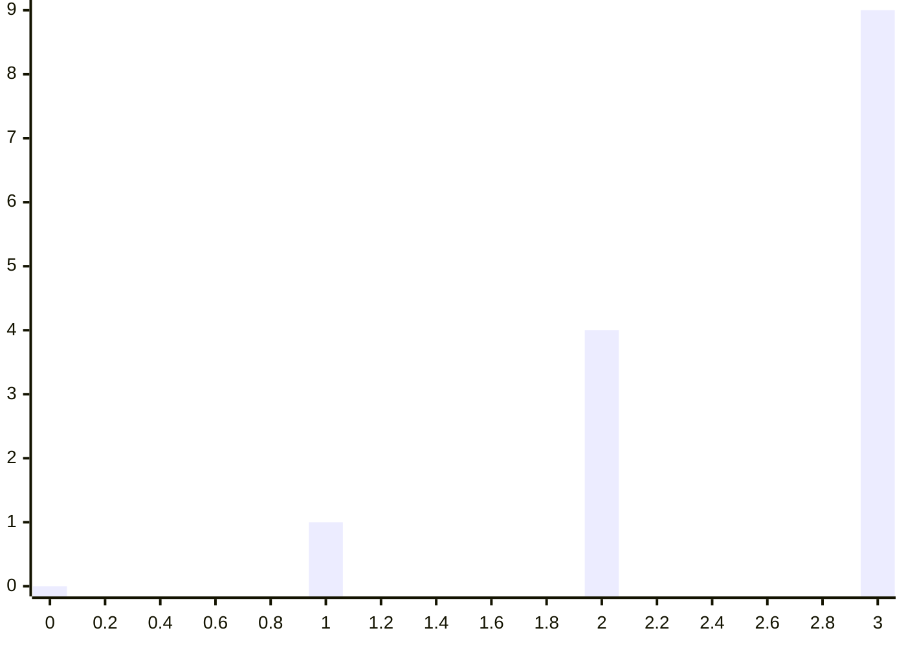
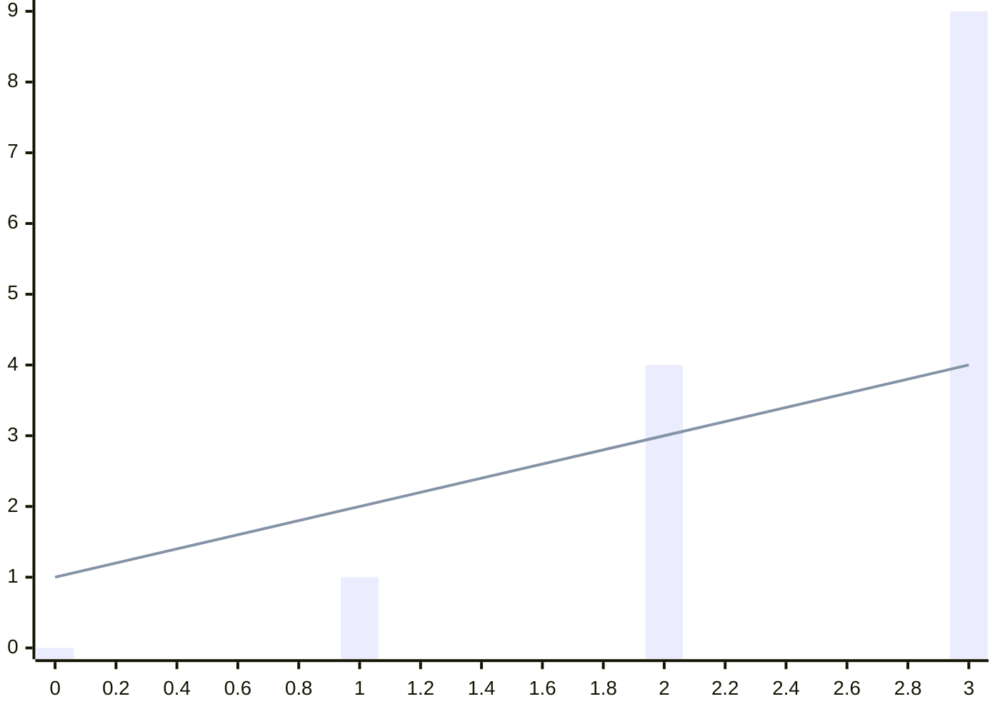

```mermaid
xychart-beta
    x-axis 0 --> 3
    line [0, 1, 4, 9]
```



```mermaid
xychart-beta
    x-axis 0.5 --> 2.5
    line [10, 20, 30]
```

```mermaid
xychart-beta
    x-axis "Time" 0 --> 3
    line [0, 1, 4, 9]
```

```mermaid
xychart-beta
    x-axis 0 --> 10
    line [0, 1, 4, 9]
```

```mermaid
xychart-beta
    x-axis 0 --> 3
    y-axis 0 --> 100
    line [0, 1, 4, 9]
```
