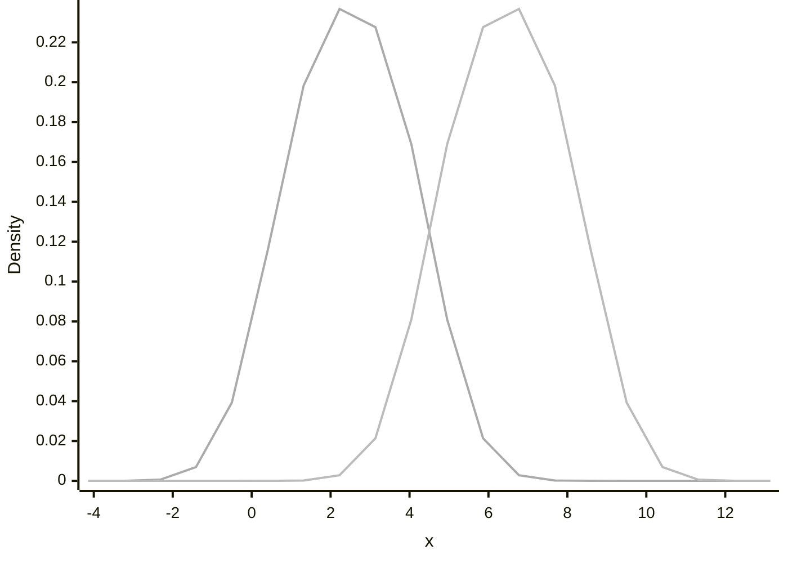

```mermaid
%%{init: {'themeVariables': {'xyChart': {'plotColorPalette': '#aaaaaa,#bbbbbb'}}}}%%
xychart-beta
    x-axis "x" -4.139072537805549 --> 13.13907253780555
    y-axis "Density"
    line [0.000000450153167, 0.000023793940793, 0.0005884205637364276, 0.006891330319624086, 0.03928841170104856, 0.1157663430497692, 0.1983718465891869, 0.23679524927195633, 0.227632472406566, 0.1689886686728623, 0.08096178758634945, 0.02133869737000445, 0.002822850209552255, 0.0001793167591818524, 0.000005361820592, 0.000000074812002, 0.00000000048524, 0.000000000001461, 0.000000000000002, 0]
    line [0, 0.000000000000002, 0.000000000001461, 0.00000000048524, 0.000000074812002, 0.000005361820592, 0.00017931675918185413, 0.0028228502095522722, 0.02133869737000456, 0.08096178758634977, 0.16898866867286258, 0.22763247240656614, 0.2367952492719564, 0.19837184658918675, 0.11576634304976884, 0.0392884117010485, 0.006891330319624038, 0.0005884205637364262, 0.000023793940793, 0.000000450153167]
```
